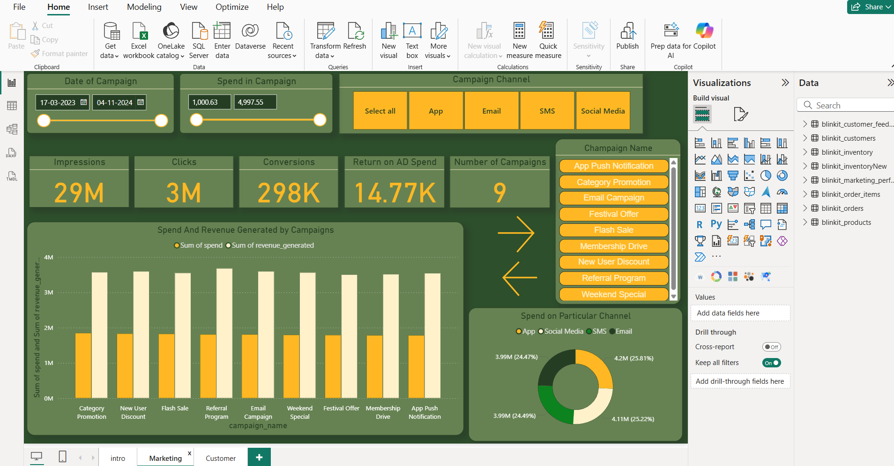
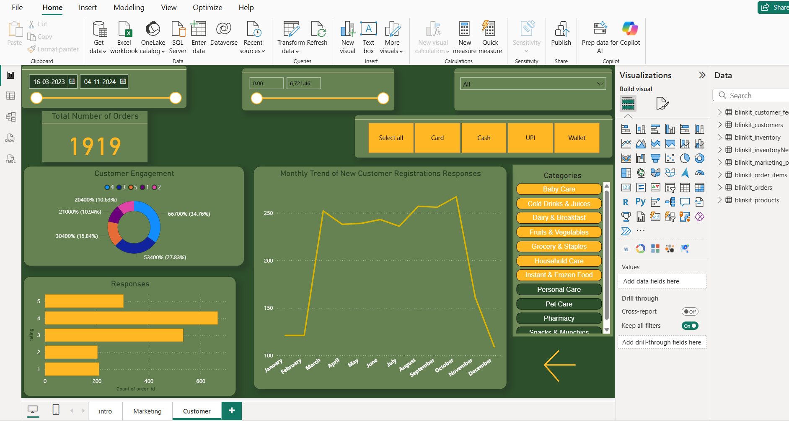

# 🛒 Blinkit Sales Analysis Dashboard (Power BI)

This repository contains an interactive Power BI dashboard that analyzes Blinkit's e-commerce performance metrics. The goal is to uncover key business insights by processing raw data collected from Kaggle, cleaning it using DAX, and designing a user-friendly dashboard.

---

## 📥 Data Source

- Data collected from [Kaggle](https://www.kaggle.com/)
- Raw sales, orders, and delivery data were imported into Power BI
- DAX functions were used to:
  - Clean null or irrelevant values
  - Create calculated columns (e.g., profit margins, delivery times)
  - Build custom measures (e.g., average order value, customer retention)

---

## 🧩 Step-by-Step Process

1. **Data Collection**
   - Downloaded raw CSV data from Kaggle
   - Imported into Power BI using "Get Data"

2. **Data Cleaning with DAX**
   - Removed blanks, nulls, and invalid records
   - Used `CALCULATE`, `FILTER`, `IF`, `SWITCH`, and `SUMX` to generate useful metrics

3. **Data Modeling**
   - Created relationships between tables: orders, products, customers
   - Built star schema model with fact and dimension tables

4. **Dashboard Design**
   - Built pages with interactive visuals including:
     - KPI Cards
     - Bar/Line Charts
     - Pie Charts
     - Date Filters and Slicers

5. **Power BI Service**
   - Report connected to **Power BI Server** for publishing and sharing
   - Scheduled refresh enabled (if applicable)

---

## 🖼️ Sample Visuals

> _Exported from Power BI:_

### 📌 Sales Overview  


### 📌 Customer Orders  



> Save your dashboard screenshots in the `images/` folder and name them accordingly.

---

## 🛠️ How to Use

1. Clone this repo:
   ```bash
   git clone https://github.com/yourusername/blinkit-powerbi-dashboard.git
